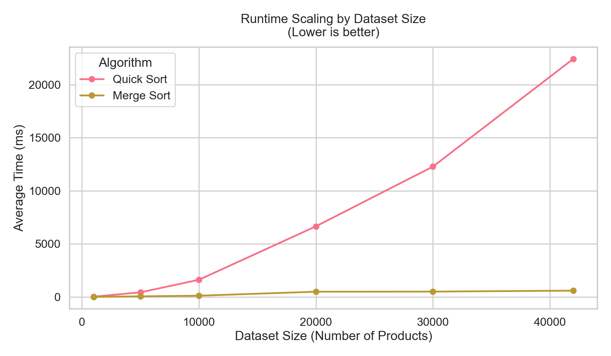
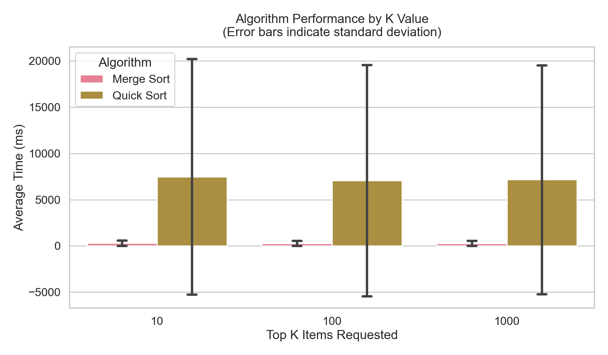
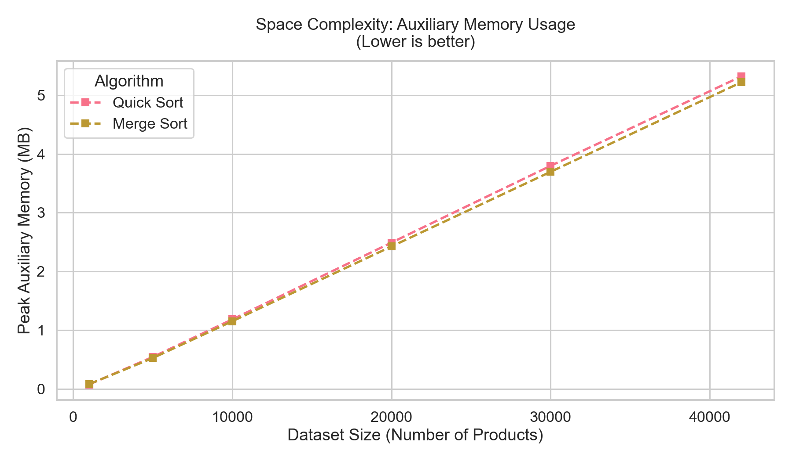
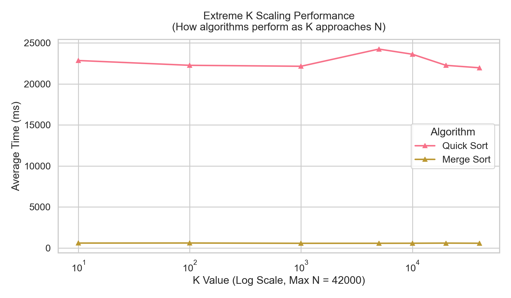

# Benchmark Report

**Test Configuration**: 6 dataset sizes, 7 k values, 2 strategies, 2 algorithms

## Visualizations

### 1. Runtime Scaling (Time Complexity Data)

> **Description:** This plot visualizes the theoretical time complexity of each algorithm. It plots the execution time (in milliseconds) as the dataset size ($N$) grows, holding other variables constant. Expected performance is $O(N \log N)$ across varying dataset sizes.

### 2. Algorithm Comparison by $K$ Value

> **Description:** Compares how algorithms handle varying small sizes of $K$ (e.g., top 10 vs top 100 vs top 1000). The error bars represent the standard deviation of execution time, indicating consistency. Note whether an algorithm becomes unpredictably slower as $k$ increases.

### 3. Space Complexity (Memory Usage)

> **Description:** This plot measures execution footprint (auxiliary space complexity). Algorithms like Merge Sort instantiate temporary structures for subarrays ($O(N)$), driving a linear increase in peak memory, whereas in-place variants like Quick Sort usually observe a smaller $O(\log N)$ recursion stack overhead.

### 4. Extreme $K$ Scaling

> **Description:** Explores performance when traversing into edge cases: asking for the top 10,000, 20,000, or up to $N$ items from the maximum dataset size. If the time stays strictly logarithmic, $k$ has low impact. If it worsens significantly as $k$ approaches $N$, the algorithm relies heavily on discarding segments early.

## Summary Statistics

### By Algorithm

**MERGE_SORT**
- Mean: 344.8356 ms
- Min: 4.1335 ms
- Max: 923.1968 ms
- Std Dev: 271.3276 ms

**QUICK_SORT**
- Mean: 10110.5847 ms
- Min: 11.0733 ms
- Max: 45010.6565 ms
- Std Dev: 15095.1767 ms

### By Dataset Size

**1,000 products**: 14.3328 ms (±12.5825)
**5,000 products**: 241.8786 ms (±294.7292)
**10,000 products**: 862.9693 ms (±1256.8987)
**20,000 products**: 3571.5332 ms (±4771.3048)
**30,000 products**: 6390.0291 ms (±9488.6510)
**42,000 products**: 11681.0563 ms (±17818.0779)

### By K Value

**k=10**: 3895.6729 ms (±9540.8578)
**k=100**: 3676.5266 ms (±9294.9622)
**k=1000**: 3724.4860 ms (±9243.1066)
**k=5000**: 12415.8793 ms (±21773.8497)
**k=10000**: 12102.6901 ms (±21093.3379)
**k=20000**: 11434.6534 ms (±19461.4052)
**k=40000**: 11276.2876 ms (±19232.1613)

## Test Statistics

- **Total configurations tested**: 88
- **Total runs**: 264 (3 per configuration)
- **Overall mean time**: 5227.7101 ms
